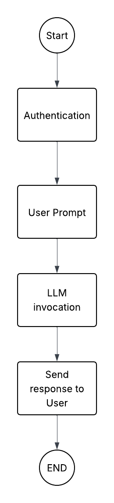

# Technical Interview - Takehome Project

## Objective
Develop a lightweight conversational AI service using Langchain. The service should expose at least one API endpoint for chat interactions, run a Flask application, and be containerized in Docker. A user should be able to ask a question using the endpoint built in Flask, and recieve an answer from an LLM using Langchain.

#  Document AI Chat Application
A conversational AI application that allows users to interact with an AI assistant to extract insights and ask general knowledge questions.
The system uses LangChain, LangGraph, and Google Gemini for conversational intelligence.
---
##  Features
- Ask general knowledge questions
- AI conversation flow using LangGraph
- Secure authentication and storage
---
##  Architecture Overview
### Core Components
| Component              | Description                                                                              |
|------------------------|------------------------------------------------------------------------------------------|
| **Flask Backend**      | Handles HTTP requests, routing, and authentication                                       |
| **LangChain**          | Framework for building LLM-powered applications                                          |
| **LangGraph**          | Manages conversation flow logic                                                          |
| **Google Gemini**      | Large Language Model used for response generation                                        |
| **PostgreSQL**         | Stores the chat history(langgraph implementation), user credentials and session metadata |
### System Flow

---
## Setup & Installation
### Prerequisites
- Python 3.10+
- PostgreSQL
- Google Gemini API Key
###  Environment Variables
Create a `.env` file in the project root:
```bash
GOOGLE_API_KEY="your-google-api-key"
PORT=5000
DB_USER="your_postgres_user"
DB_HOST="localhost"
DB_PASSWORD="your_postgres_password"
DB_PORT="5432"
DB_NAME="langchain_test"
SECRET_KEY="your-secret-key"
```
---
###  To run the project on your machine locally, run these commands in the given sequence
```bash
# Clone the repository
git clone https://github.com/your/repo.git
cd repo
# Setup virtual environment
python -m venv .venv
source .venv/bin/activate  # Windows: .venv\Scripts\activate
# Install dependencies
pip install -r requirements.txt
# Run the application
python main.py
```
---
###  Docker Setup
```bash
# Run with Docker Compose
docker-compose up -d
```

This will start both the PostgreSQL container and the Flask application.
---
##  API Endpoints
###  Authentication
#### Register
`POST /signup`
```json
{
  "username": "user123",
  "password": "securepassword"
}
```
**Response:**
```json
{
    "message": "Sign-up successful"
}
```
#### Login
`POST /login`
```json
{
  "username": "user123",
  "password": "securepassword"
}
```
**Response:**
```json
{
    "message": "Sign-in successful"
}
```
---
###  Chat Interface
`POST /chat`
**Headers:**
```
Cookie: session_id={session_id}
Content-Type: application/json
```
**Payload:**
```json
{
  "message": "What is the capital of USA?"
}
```
**Response:**
```json
{
    "response": "The capital of the USA is Washington, D.C."
}
```
---
##  Core Functionality
###  Chat Flow
1. **Query**: Send query
2. **LangGraph Nodes**:
   - `generate`: Creates AI response
3. **Final Response**:
   - Generates response
   - Uses chat history for coherence
---
###  User Session Management
- Each session gets a UUID
- Session ID is used for:
  - Set cookie
  - Chat context
---
## Project Structure
```
.
├── app/
│   ├── __init__.py
│   ├── auth_routes.py         # Authentication APIs
│   └── chat_routes.py 
│
├── langchain_integration/
│   ├── __init__.py
│   ├── langgraph_flow.py      # Conversation logic
│
├── config.py
├── db_connection.py
├── main.py
├── Dockerfile
├── docker-compose.yml
└── requirements.txt
```
---
## Technologies Used
- **Flask**: Python web framework
- **LangChain**: LLM pipeline framework
- **LangGraph**: AI conversation routing
- **Google Gemini**: Large language model
- **PostgreSQL**: Relational DB
---

 